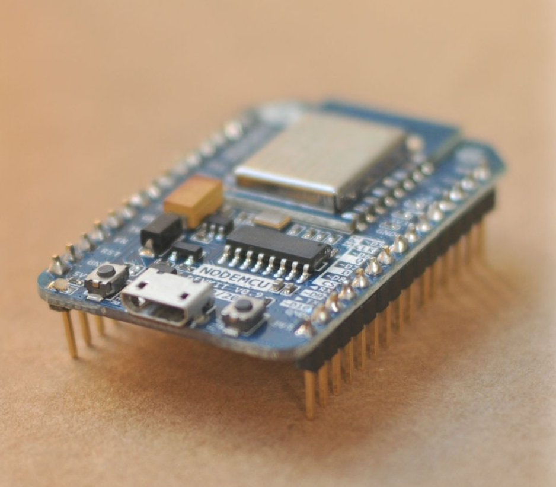
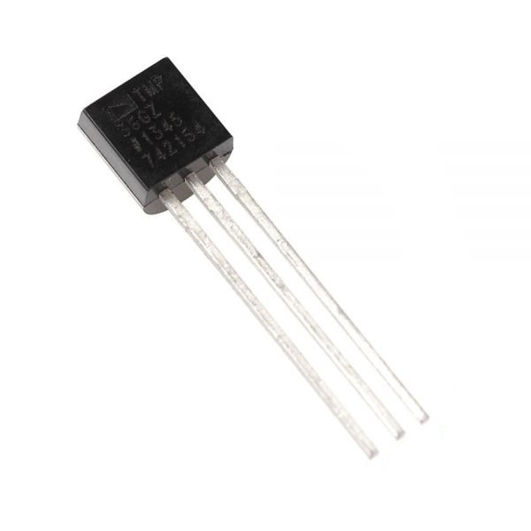
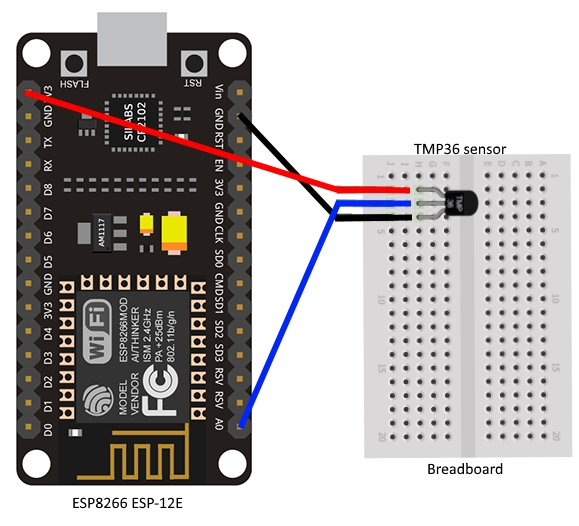

# Hardwareaufbau

zurück zur [Übersicht](../README.md).

## Komponenten

### NodeMCU Amica 

(https://www.nodemcu.com/index_en.html)

Der NodeMCU hier ist die Verion 1.0 mit einem ESP-12-E.  (https://github.com/nodemcu/nodemcu-devkit-v1.0/)

### Temperature Sensor TMP36GZ

Der Sensor TMP36 ist einer der Klassiker unter den Temperatursensoren für den Arduino. Er ist günstig, leicht zu handlen und für die meisten deiner Projekte mit ±2°C gerade noch genau genug. Hier das
[Datenblatt des TMP36](assets/TMP35_36_37.pdf).

* Betriebsspannung: 2,7V – 5V
* Betriebstemperatur: -55°C – 150°C
* Messbereich: -40°C – 125°C
* Genauigkeit: ±2°C
* Anschluss: Analog

## Aufbau

Die Verkabelung ist recht einfach:

Der Temperatursensor hat diese Anschlüsse:

diese Info bekommt man auch im [Datenblatt des TMP36](assets/TMP35_36_37.pdf).

